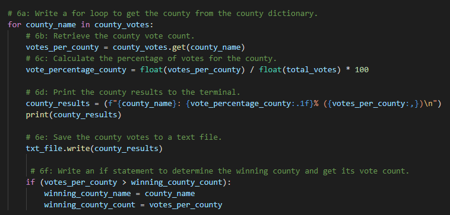
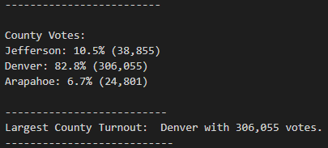
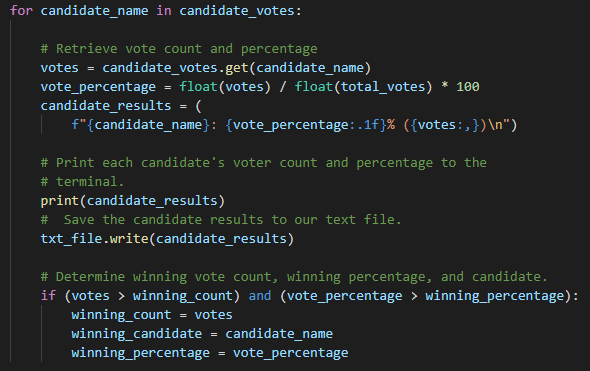

# Analysis of an Election in Colorado

## Overview of Election Audit:
The purpose of this project is to help Tom find the results of an election in Colorado. At first, he was looking for the total number of votes, total votes per candidate, percentage of votes per candidate, and the winner by popular vote. However, in this project, he has asked me to amend the code in Python to include: number of votes per county, percentage of votes per county, and which county had the largest voter turnout.

## Election-Audit Results: 

-How many votes were cast in this congressional election?
369,711 total votes were cast in this election.

-Provide a breakdown of the number of votes and the percentage of total votes for each county in the precinct.
Below is the code that was used to find the number of votes and the percentage of total votes for each county in the precinct. 

Not pictured here was the creation a list of all the different counties listed in the data-- the list was named county_list. After finding the counties,  an empty dictionary was created named county_votes. What we begin to see at the top of the code here (within the dictionary) is the pairing of the county_names (keys) to the votes_per_county (values). Then, the percentage of votes within each county out of the total votes is calculated. Under comments 6d and 6e show the process of displaying the answers we have found to the number of votes and the percentage of total votes for each county in the precinct. Then under comment 6f the winning county along with its vote count is assigned to a variable to display later. The results are shown below.

-Which county had the largest number of votes? 

Denver county had the largest voter turnout with 306,055.

-Provide a breakdown of the number of votes and the percentage of the total votes each candidate received.

Below is another picture of code to follow along with during the explanation of finding each candidates vote count and percentage of the total votes.

Just as before, a list and a dictionary are needed to group and organize the data for calculation.

-Which candidate won the election, what was their vote count, and what was their percentage of the total votes?

The candidate with the most votes was Diana DeGette. She had 272,892 votes, meaning her voters account for 73.8% of the total votes.

## Election-Audit Summary: In a summary statement, provide a business proposal to the election commission on how this script can be used—with some modifications—for any election. Give at least two examples of how this script can be modified to be used for other elections.

There is a bulleted list where each election outcome is addressed. (7 pt)
Election Audit Summary

There is a statement to the election commission that explores how this script can be used for any election, with two examples for modifying the script. (4 pt)
