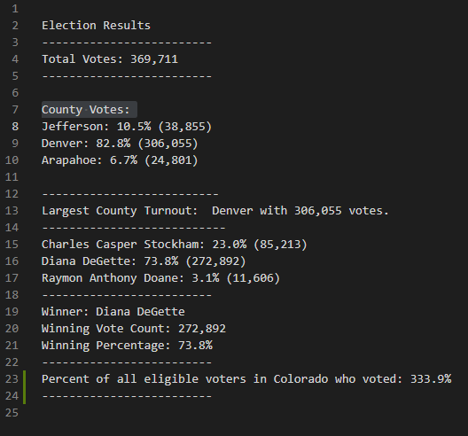

# Analysis of an Election in Colorado

## Overview of Election Audit:
The purpose of this project is to help Tom find the results of an election in Colorado. At first, he was looking for the total number of votes, total votes per candidate, percentage of votes per candidate, and the winner by popular vote. However, in this project, he has asked me to amend the code in Python to include: number of votes per county, percentage of votes per county, and which county had the largest voter turnout.

## Election-Audit Results: 
- **How many votes were cast in this congressional election?**
  - 369,711 total votes were cast in this election.

- **Provide a breakdown of the number of votes and the percentage of total votes for each county in the precinct.**
  - Below is the code that was used to find the number of votes and the percentage of total votes for each county in the precinct. 


Not pictured here was the creation a list of all the different counties listed in the data-- the list was named *county_list*. After finding the counties,  an empty dictionary was created named *county_votes*. What we begin to see at the top of the code here (within the dictionary) is the pairing of the *county_names* (keys) to the *votes_per_county* (values). Then, the percentage of votes within each county out of the total votes is calculated. Under comments 6d and 6e show the process of displaying the answers we have found to the number of votes and the percentage of total votes for each county in the precinct. Then under comment 6f the winning county along with its vote count is assigned to a variable to display later. The results are shown below. 


- **Which county had the largest number of votes?** 
  - Denver county had the largest voter turnout with 306,055.

- **Provide a breakdown of the number of votes and the percentage of the total votes each candidate received.**
  - Just as before, an empty list (*candidate_options*) and an empty dictionary (*candidate_votes*) are needed to group and organize the data for calculation. The list was completed before the picture by starting with an empty list named candidate_name and while looping through each row, adding the name to a list if the name is not already in the list. The votes for each candidate are also calculated here in this loop (as were *votes_per_county*) by tallying each vote until the *candidate_name* changed (then the tally started over at 0 and assigned each value respectively.) Below is another picture of code to follow along with during the explanation of finding each candidates vote count and percentage of the total votes.


In the code above, we see (within the dictionary created) the pairing of the *candidate_names* (keys) to the *votes* (values). Then, the percentage of votes for each was found. The results were printed into the image below.


- **Which candidate won the election, what was their vote count, and what was their percentage of the total votes?**
  - The candidate with the most votes was Diana DeGette. She had 272,892 votes, meaning her voters account for 73.8% of the total votes.

## Election-Audit Summary: 
This code will work for any election in which the data fits the 3 columns provided in the CSV file: Ballot ID, County, and Candidate. The code will not be affected if new candidates or counties are added. It will simply include the new information in the output. If there are concerns about using this code for a different kind of celection, however, here are 2 ideas for small ways the code could be modified to be used in other elections:

1. For the first modification, there is one small change that allows for all kinds of different elections. (Do not worry, there are pictures below but first an explanation.) Instead of finding the information above for counties, we can add other distinguishing factors like states, ethnicities, political party, or other demographics. Currently, the middle column of the CSV contains counties where the voter is from. If we change the information in that column to any other of these factors, the same code will run can find the count for that factor, percentage out of the total, and which type of factor had the most votes. The only thing we would need to change is the printing factors. This all sounds vague, so let us look at it concretely. 


The word county is underlined in red on lines 88 and 114. Change "County" to "State" in these lines of code after entering all the states into the second column of the CSV. Because a state is distinguishing factor of the voters that can be used to group the voters, the logic will be the same and so no further changes to the code are needed. The results look like this.


As you can see, the blue shows us that rows 7 and 13 have been changed to read "State" instead of "County". When the data of the second column of the CSV is changed, the output information for each state will be changed accordingly. This can be done for any other indentifying factors like ethnicities, political party, or other demographics. Of course, this only changes what the output would look like. A cleaner way to modify the code to make it more readable is to go through and change every instance where the word "county" was used to your new distinguishing factor. For example, if the code says *state_list* rather than *county_list* that makes the code more readable for a future coder. Keep in mind though, the logic all stays the same and this thorough cleaning is not necessary, and may even cause trouble if any 1 instance of the word "county" is left behind. 

2. The second modification is a more specific example. For this case, we are keeping the distinguishing factor as counties. We are investigating what percentage of eligible voters actually voted. What we would be looking at mathematically is simply the votes received divided by the total eligible voters in the state of Colorado. No changes to the CSV are needed, but we do need to assign the total amount of eligible voters in Colorado to a variable. 
After *total_votes = 0* skip to line 15 and write *eligible_voters = * and then write the amount after the = sign.
Then, skip to the very bottom of the code and input the code below: 

```
    # The code below will find and print what percentage of eligible voters actually voted.
    eligible_voter_percentage = float(eligible_voters) / float(total_votes) *100
    eligible_results = ( f"Percent of all eligible voters in Colorado who voted: {eligible_voter_percentage:.1f}%\n"
        f"-------------------------\n")
    print(eligible_results)
    txt_file.write(eligible_results)
```

***MAKE SURE THAT INDENTS OF YOUR CODE MATCH THE PICTURE BELOW***


The results should look like this. Notice the green line shows the results are in rows 23 & 24. You percentage will look different.




Once this code is added, you will only have to go back and edit the amount after *eligible_voters = * according to how many Coloradoans are eligible to vote during the election you are investigating.